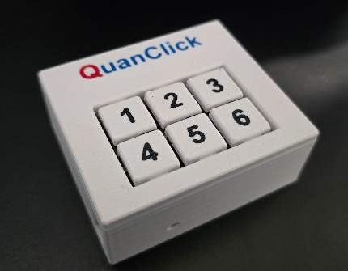

## Table of Contents
1. [Getting Started](#getting-started)
   - [Quickstart](#quickstart-i-dont-want-to-read-tutorials)
   - [In More Detail](#in-more-detail)
     - [Setting up your development environment](#setting-up-your-development-environment)
     - [Programming your QuanClick](#programming-your-quanclick)
2. [Customization](#customization)

## What


QuanClick is a six-button macro keyboard (and HID) device, designed to be low cost, easy to assemble, and easy to customize.

## Why
To support and promote S.T.E.A.M. (Science, Technology, Engineering, Arts, and Mathematics) education, experimentation, and exposure in the community.

## Who
Designed, prototyped, and produced by members of [Quantum Technology Club](https://quantumtech.club/)

## Getting Started

All files, examples, and documentation assume development on a [Raspberry Pi Pico v2](https://www.raspberrypi.com/products/raspberry-pi-pico-2/) development board.

Source code is in the '/src/' folder. Each `code.py` should have an accompanying `README.md`.

### Quickstart (I don't want to read tutorials)

1. Clone or download this repository
2. Boot the Raspberry Pi Pico 2 into firmware loading mode (see detailed instructions below)
3. Copy the CircuitPython firmware onto the drive that appears from: `/board_files/firmware_pico_v2/adafruit-circuitpython-raspberry_pi_pico2-en_GB-9.2.1.uf2`
4. Wait for the Pico to reboot and show up again
5. Copy the contents of `board_files/lib` to the Pico 2 
6. Copy the basic example from `src/code.py` into the root of the drive that shows up after the reboot

### In More Detail

#### Setting up your development environment

1. Install Thonny IDE:
   - Download and install Thonny from [https://thonny.org/](https://thonny.org/)
   - Thonny provides a user-friendly interface for programming and interacting with your Raspberry Pi Pico

2. Prepare your Raspberry Pi Pico:
   - Connect your Pico to your computer using a micro-USB cable
   - Hold down the BOOTSEL button on the Pico while plugging it in to enter firmware loading mode

3. Install CircuitPython:
   - Download the CircuitPython UF2 file for Raspberry Pi Pico 2 from the `/board_files/firmware_pico_v2/` directory in this repository
   - Drag and drop the UF2 file onto the RPI-RP2 drive that appears when the Pico is in firmware loading mode
   - The Pico will reboot and appear as a new drive named CIRCUITPY

4. Set up the required libraries:
   - Copy the contents of the `board_files/lib` directory from this repository to the `lib` folder on your CIRCUITPY drive

#### Programming your QuanClick

1. Open Thonny IDE
2. In Thonny, go to "Tools" > "Options" > "Interpreter" and select "CircuitPython (generic)" as the interpreter
3. Click on "Select port" and choose the port corresponding to your Raspberry Pi Pico
4. Open the `src/code.py` file from this repository in Thonny
5. Click the "Run" button or press F5 to run the code on your Pico

For more detailed information on getting started with CircuitPython on Raspberry Pi Pico, refer to these Adafruit guides:
- [Getting Started with Raspberry Pi Pico and CircuitPython](https://learn.adafruit.com/getting-started-with-raspberry-pi-pico-circuitpython/overview)
- [CircuitPython Programming Basics](https://learn.adafruit.com/getting-started-with-raspberry-pi-pico-circuitpython/circuitpython-programming-basics)

## Customization

To customize your QuanClick:

1. Open the `src/code.py` file in Thonny
2. Modify the `button_actions` dictionary to change the behavior of each button
3. Use the appropriate `Keycode` values from the `adafruit_hid.keycode` module for keyboard actions
4. For mouse actions, specify the movement amounts or button to click

Example customization:
```python
button_actions = {
    0: {"type": "keyboard", "action": [Keycode.CTRL, Keycode.C]},  # Copy
    1: {"type": "keyboard", "action": [Keycode.CTRL, Keycode.V]},  # Paste
    2: {"type": "mouse_move", "action": (0, -10)},  # Move mouse up
    3: {"type": "mouse_move", "action": (0, 10)},   # Move mouse down
    4: {"type": "mouse_click", "action": Mouse.LEFT_BUTTON},
    5: {"type": "mouse_click", "action": Mouse.RIGHT_BUTTON}
}